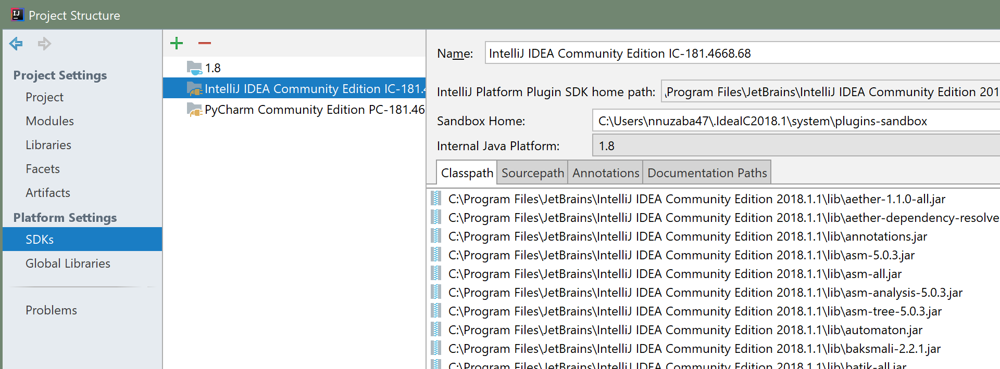
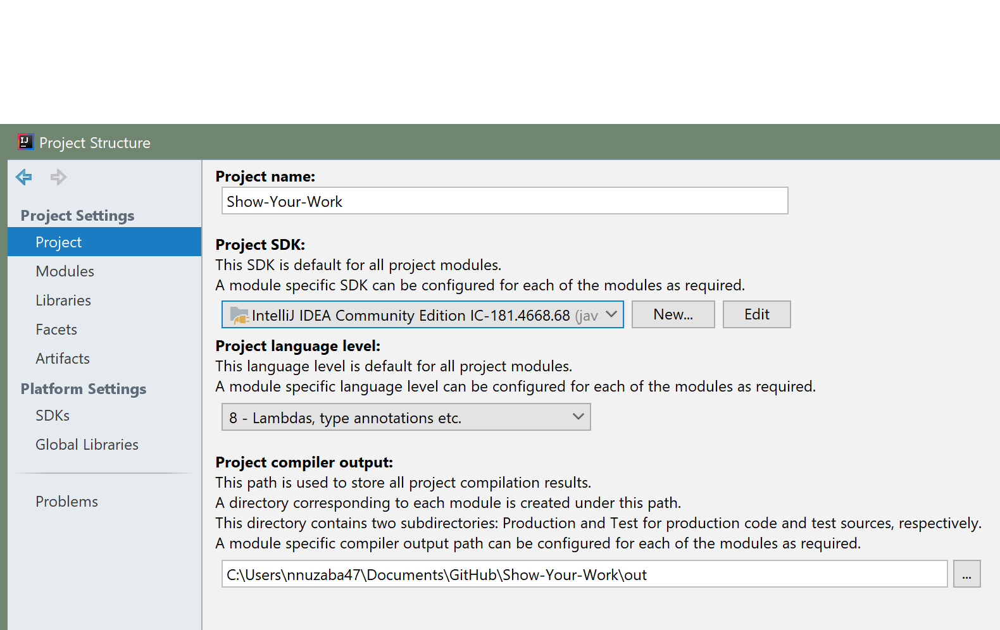
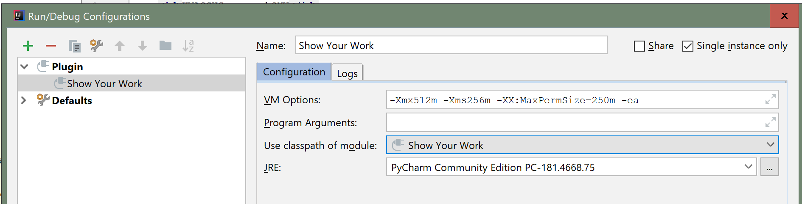

This tutorial was written using the 2018 versions of [Intellij IDEA Community Edition](https://www.jetbrains.com/idea/download/#section=windows) and [Intellij Pycharm Community Edition](https://www.jetbrains.com/pycharm/download/#section=windows).
1. **Set up SDK:** After pulling/cloning the repository, and opening it in Intellij IDEA, go to File->Project Structure->SDKs. If you don't have one already press the + button and add a 'JDK'. This will prompt you to 'Select a Home Directory' for the JDK. For Windows, go to C:\ProgramFiles\Java and choose 'jdk<version no>' (I used jdk1.8.0_171, which you can download from http://www.oracle.com/technetwork/java/javase/downloads/jdk8-downloads-2133151.html, but other versions of SDK 1.8 should also be fine) After this press the + button again to add a new SDK, this time choose 'Intellij Platform Plugin SDK' as the type for the new SDK. This will prompt you to 'Select a Home Directory' for the SDK. If the system doesn't automatically do it for you, choose 'Intellij IDEA Community Edition <version no>" (should be listed under C:\ProgramFiles\Jetbrains in Windows). After that it will ask you to choose an internal JAVA platform, for this choose the JDK you created earlier, (most probably named 1.8). Repeat this step, but this time instead of IDEA, use 'Pycharm Community Edition <version no>' as the home directory. Press OK to finish this step. The SDK window should look something like this.

1. **Choose Project SDK:** In Project Structure choose Project. For Project SDK choose the Intellij IDEA Platform Plugin SDK that you created in the previous step. For Project Language Level, choose '8 - Lambdas, Type annotations etc.'. Press OK to finish. 

(If you're having trouble running the module, you can check Project Structure->Module->Source and make sure that you only have src as the only 'Source Folder', and resources as the only 'Resources Folder' and nothing else under '+Add content root'. However this is unlikely to be an issue)

1.**Edit Run Configuration:** After that first select Build->Build Project from the menu bar. Afther this choose Run->Edit Configuration. If a configuration named 'Plugin' with a plugin icon next to it doensn't already exist, press the '+' button, then for 'Use classpath of module' select 'Show Your Work', and for JRE select the 'Pycharm Community Edition <version no>' that was created earlier. After that, pressing the 'Run' button should initiate a Pycharm window where the plugin would be loaded and can be tested.

