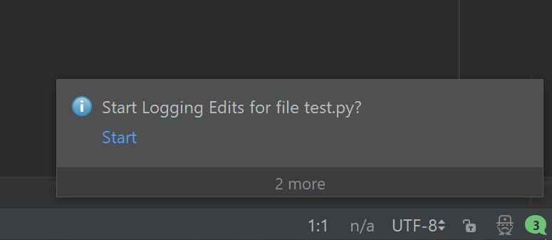
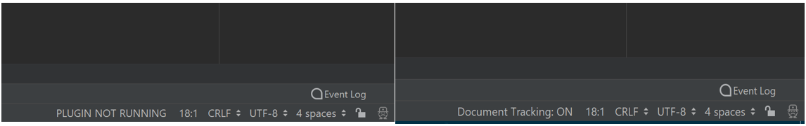

# Show-Your-Work
This plugin allows programmers to log their coding activity.

To use the plugin, download the 'Show Your Work.jar' file, open a Pycharm Project, go to File->Settings->Plugins->Install from Disk and then select the .zip file and then restart.

If there's an editor open, and it's a .py file, the following actions can be found under the VCS tab under the name "Show Your Work Plugin Tools".

Once an editor tab is opened with a .py file, the 'Start Logging Edits' button creates or updates a CSV file named '.csv' located in the same directory as the original file. The button disappears after the first press, as to avoid multiple logging of the same event. Alternatively the logging can be started by pressing the 'Start' button on the notification that pops up everytime a new tab is opened. (If the notification does not show up, go to Event Logs, click the Wrench icon, and click 'Enable Balloon Notifications')

The 'Generate Zip for Submission' button creates a zip file named '_log.zip' in the current directory, which contains a text version of the original file, as well as the CSV log file. It only appears if the file is .py and has a log running.

The 'Generate Original from Log' button generates a txt file that uses the CSV log file to replicate the original into a file named '_currentVersion.txt', also located in the same directory as the original (mostly here for testing purposes). Like the 'Generate Zip for Submission' button, this button requires a .py file and its associated log file to be visible to the user.

When the plugin is running for the active editor tab, the status bar has the text "Document Tracking: ON". If not, then the status bar should have the text "PLUGIN NOT RUNNING". (will not work correctly for a file that is open in more than one PyCharm application window)

