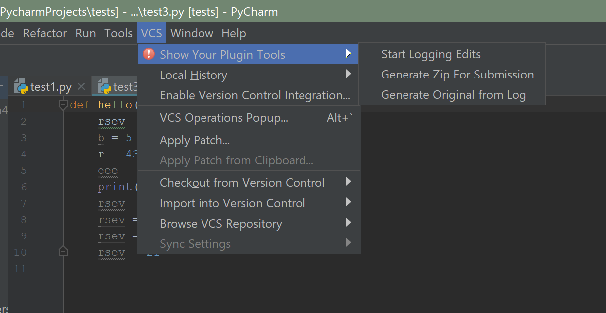

# Show-Your-Work
This plugin allows users to log their cdoing activity.

The actions can be found under the VCS tab under the name "Show Your Plugin Tools". 

Once an editor tab is opened, the 'Start Logging Edits' button creates or updates a CSV file named '(filename).csv' located in the same directory as the original file.
The 'Generate Zip for Submission' button creates a zip file named '(filename)_log.zip' in the current directory, which contains a text version of the original file, as well as the CSV log file.
The 'Generate Original from Log' button generates a txt file that uses the CSV log file to replicate the original into a file named '(filename)_currentVersion.txt', also located in the same directory as the original.

